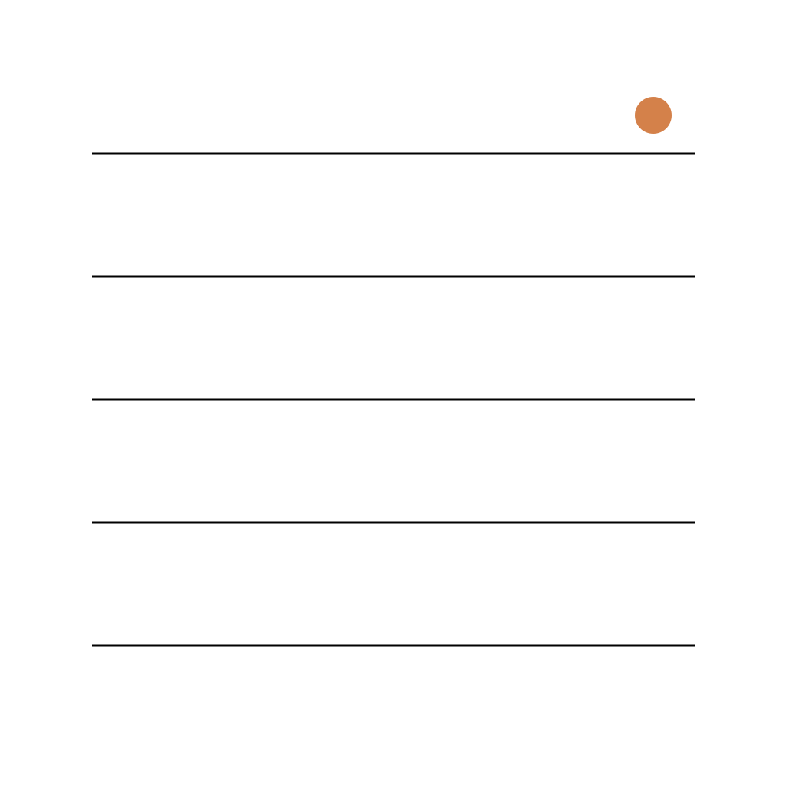

<p align="center">
  
</p>

<h1 align="center">卡迹 · KaJi</h1>

<p align="center">
  以「卡片」为最小单位的 macOS 原生知识记录工具。<br/>
  把术语、反常识、新知、金句、行动……拆成一张张可检索的卡片。
</p>

<p align="center">
  
  
  
  
  
</p>

---

## 为什么是「卡片」

笔记软件大多鼓励你写「长文」，但知识的真正单位是**一个个独立、可复用、可重组的片段**——一条术语、一个反直觉的事实、一句值得记下的话。

卡迹（KaJi）把这种「卡片式记录」做成了 macOS 上的一等公民：每张卡片有明确的**类型**和**结构化字段**，落地为纯文本 `.md` 文件，由本地数据库建立索引。记录快、检索快、数据始终在你自己手里。

## ✨ 核心特性

- **🗂 12 种内置卡片类型** —— 每种类型自带一套结构化字段，记录时不再面对空白页（见下表）。
- **🎨 类型可定制** —— 支持新建自定义类型、调整字段、重排顺序、控制侧栏可见性。
- **📝 结构化编辑器** —— 表单式字段录入，信纸横线背景，编辑/只读态共用同一文本引擎，行高像素级一致。
- **🏷 标签系统** —— 每张卡片可打多个标签，侧栏自动展示高频标签 Top 10。
- **🔍 即时搜索** —— 右上角搜索入口从右向左展开，结果即时呈现。
- **🗑 回收站** —— 软删除可恢复，超过保留天数自动清理，删除内容完整保留。
- **🖥 真·原生体验** —— 红绿灯按钮融入侧栏玻璃、透明 titlebar、窗口尺寸按屏幕比例自适应并持久化，全程遵循 macOS Human Interface Guidelines。
- **🔒 本地优先** —— 数据以 `.md` 纯文本存于本地，无账号、无云端、无追踪。

### 内置卡片类型

| 类型 | 用途 | 主要字段 |
|------|------|----------|
| 术语卡 | 概念与定义 | 定义 · 解释 · 例子 |
| 反常识卡 | 颠覆直觉的事实 | 常识 · 反常识 · 例子 |
| 新知卡 | 知识更新 | 已知 · 新知 · 例子 |
| 人物卡 | 人物速写 | 简介 |
| 金句卡 | 值得记下的话 | 原句 · 评论 |
| 新词卡 | 生词与表达 | 原句 · 造句 |
| 行动卡 | 待办与行动 | 内容 · 行动 |
| 事件卡 | 事件记录 | 时间 · 地点 · 参与者 · 经过 · 理解 |
| 图示卡 | 图表与示意 | 说明 |
| 索引卡 | 引用索引 | 引用 |
| 综述卡 | 论点综述 | 论点 |
| 自由卡 | 不限格式 | 内容 |

> 每张卡片均含「标题」「参考」与唯一编码（UUID）。字段在数据库中以 EAV 模式存储，可按类型自由扩展。

## 📦 安装

### 方式一：下载 DMG（推荐）

前往 [Releases](https://github.com/wxmpro/KaJi-macOS/releases) 下载最新的 `KaJi-vX.Y.Z.dmg`，双击挂载后将 `KaJi.app` 拖入「应用程序」即可。

> 当前为 ad-hoc 签名分发，首次打开若被 Gatekeeper 拦截，可在「系统设置 → 隐私与安全性」中点击「仍要打开」。

### 方式二：从源码构建

```bash
git clone https://github.com/wxmpro/KaJi-macOS.git
cd KaJi-macOS

# 一键构建 + 安装 + 启动（内部自动 xcodegen generate）
./scripts/build.sh

# 仅构建，不启动
./scripts/build.sh --no-run

# 打包 Release DMG 到 dist/
./scripts/package_dmg.sh --release
```

> 项目使用 [XcodeGen](https://github.com/yonaskolb/XcodeGen) 管理工程，`project.yml` 是唯一真源，`KaJi.xcodeproj` 为生成产物。

## 🗄 数据存储与隐私

| 内容 | 位置 |
|------|------|
| 卡片正文 | `~/Library/Application Support/KaJi/cards/<uuid>.md` |
| 索引与元数据 | `~/Library/Application Support/KaJi/index.sqlite` |

- 所有数据**仅存于本地**，可在「设置 → 高级」中查看并打开数据目录。
- 卡片为标准 Markdown 纯文本，随时可被其他工具读取、备份、迁移。
- 分发的 DMG **不包含任何用户数据**，安装后即为全新空白应用。

## 🏗 技术栈

- **语言**：Swift 6.0（完整并发模型，`Sendable` / actor 隔离）
- **UI**：SwiftUI 为主，AppKit 处理窗口、文本引擎等原生细节
- **数据层**：[GRDB.swift](https://github.com/groue/GRDB.swift)，SQLite 索引 + `.md` 文件双写
- **状态管理**：`@Observable`，按职责拆分为 `EditorState` / `ListState` / `StatsState`
- **目标系统**：macOS 26+

## 📁 项目结构

```
KaJi/
├── App/          # 应用入口、全局状态、卡片类型注册表
├── Database/     # GRDB 数据层（仓储、文件 IO、错误体系）
├── Models/       # Card / CardType / CardField / ListFilter
├── Services/     # 卡片生命周期、类型变更、持久化协调
├── Utilities/    # 设置、导出、布局、ID 生成等工具
├── Views/        # SwiftUI 视图（Main / Sidebar / List / Editor / Search / Settings）
└── Assets.xcassets/  # 应用图标
```

## 🛠 开发规范

项目遵循严格的工程纪律：

- 核心工作流：**理解 → 规划 → 修改 → 验证**，不验证不算完成
- 语义化版本（`MAJOR.MINOR.PATCH`），**每次推送必带版本号 + git tag**
- 「未经实测不推送」红线：Build 通过 ≠ 修复有效
- 优先使用最新 macOS 原生 API 与组件，杜绝死代码与硬编码

完整更新记录见 [Releases](https://github.com/wxmpro/KaJi-macOS/releases)。

## 📄 许可

[MIT](LICENSE) © 2026 KaJi
